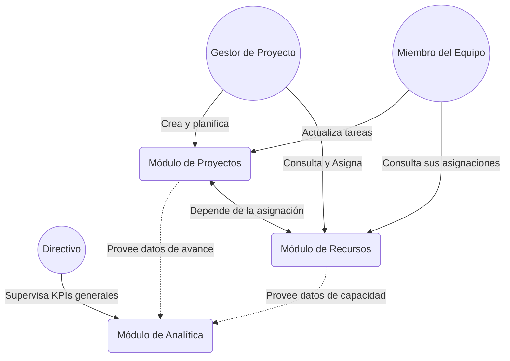

# Innovatech Solutions – Plataforma Inteligente

## Contexto
Innovatech Solutions es una empresa dedicada al desarrollo de software a medida y consultoría para organizaciones de diversos sectores, incluyendo retail, fintech, organizaciones públicas y privadas. Con más de 120 empleados distribuidos en múltiples equipos, la empresa busca resolver los desafíos de coordinación y gestión eficiente mediante el desarrollo de una plataforma tecnológica integrada que centralice la gestión de proyectos, mejore la colaboración y ofrezca herramientas analíticas para la toma de decisiones.

---

## Requerimientos Funcionales (RF)

### Módulo 1: Gestión de Proyectos
* **RF1.1:** El sistema debe permitir crear, editar, eliminar y visualizar proyectos.
* **RF1.2:** El sistema debe permitir definir tareas o entregables asociados a cada proyecto.
* **RF1.3:** El sistema debe permitir la asignación de individuos o roles específicos a las tareas del proyecto.
* **RF1.4:** El sistema debe permitir actualizar y monitorear el estado y avance de las tareas (ej. Pendiente, En Progreso, Completado).
* **RF1.5:** El sistema debe notificar a los responsables sobre nuevas asignaciones y fechas de entrega vencidas.

### Módulo 2: Gestión de Recursos y Colaboración
* **RF2.1:** El sistema debe mantener un registro de los profesionales con su rol, habilidades y proyectos asignados.
* **RF2.2:** El sistema debe mostrar la disponibilidad y la capacidad de trabajo (*capacity*) de cada profesional en tiempo real para evitar sobrecarga o subutilización.
* **RF2.3:** El sistema debe permitir la asignación o reasignación de profesionales a diferentes proyectos según su disponibilidad.
* **RF2.4:** El sistema debe proveer herramientas o foros asociados a cada proyecto para que los equipos registren comentarios y notas de colaboración.

### Módulo 3: Monitoreo y Analítica
* **RF3.1:** El sistema debe proveer un panel (Dashboard) interactivo dirigido a directivos y gestores de proyecto.
* **RF3.2:** El sistema debe calcular y mostrar indicadores clave de desempeño (KPIs) en tiempo real (ej. tasa de cierre de tareas, retrasos).
* **RF3.3:** El sistema debe mostrar métricas de avance de cada proyecto en comparación con los plazos establecidos.
* **RF3.4:** El sistema debe mostrar métricas de utilización de recursos por área o por proyecto.

---

## Requerimientos No Funcionales (RNF)

* **RNF1 (Usabilidad):** La interfaz de usuario debe ser intuitiva, responsiva y adaptable a dispositivos móviles y de escritorio.
* **RNF2 (Rendimiento):** El sistema debe soportar acceso concurrente de al menos 120 usuarios sin comprometer los tiempos de respuesta.
* **RNF3 (Seguridad):** El sistema debe requerir autenticación para el acceso a la plataforma, y utilizar roles de usuario (ej. Administrador, Gestor de Proyecto, Desarrollador) para autorizar accesos a distintos módulos.
* **RNF4 (Escalabilidad):** El sistema debe estar diseñado de forma que permita agregar nuevas funcionalidades o aumentar la carga de usuarios sin interrupciones severas.
* **RNF5 (Auditoría):** Toda asignación o cambio de estado de tareas importantes debe quedar registrada con el historial de modificaciones y el usuario responsable.

---

## Casos de Uso Principales

1. **Crear / Planificar un Proyecto**
   * *Actor:* Gestor de Proyectos
   * *Descripción:* El gestor ingresa la información del nuevo proyecto, define etapas y tareas específicas.
2. **Consultar Capacidad de Equipo y Asignar Recurso**
   * *Actor:* Gestor de Proyectos / Roles de Liderazgo
   * *Descripción:* El líder revisa el tablero de *capacity*, verifica la disponibilidad de un profesional y lo asigna a un proyecto.
3. **Actualizar el Estado de una Tarea**
   * *Actor:* Miembro del Equipo
   * *Descripción:* El profesional ingresa al sistema, revisa sus tareas asignadas y cambia su estado al finalizar el trabajo, pudiendo añadir comentarios.
4. **Visualizar el Rendimiento Global (Dashboard)**
   * *Actor:* Directivo
   * *Descripción:* El directivo accede al panel de control interactivo para observar el avance de la empresa, utilización de recursos globales y proyectos críticos o atrasados.

---

## Diagrama de Funcionamiento (Alto Nivel)

---

## Entorno de Desarrollo y Despliegue

Este proyecto está completamente contenerizado para facilitar la colaboración en diferentes entornos (Windows, Mac, Linux) y con diversos IDEs (IntelliJ IDEA, VS Code, etc.). A continuación, se explica paso a paso cómo levantar el proyecto completo.

### Prerrequisitos Generales
Antes de comenzar, asegúrate de tener instalados:
- **Docker**: Versión 20.10 o superior. [Descargar aquí](https://www.docker.com/get-started).
- **Docker Compose**: Generalmente viene incluido con Docker Desktop. Si no, [instálalo aquí](https://docs.docker.com/compose/install/).
- **Git**: Para clonar el repositorio (opcional si ya tienes el código).

### Método 1: Ejecutar Todo con Docker (Recomendado para Inicio Rápido)
Este método levanta todos los microservicios, bases de datos y el frontend en contenedores, sin necesidad de instalar Java, Maven o Node.js localmente.

#### Pasos:
1. **Clona o navega al repositorio**:
   - Si no tienes el código, clónalo: `git clone <url-del-repositorio>`
   - Navega al directorio del proyecto: `cd innovatech_chile`

2. **Verifica que Docker esté corriendo**:
   - Ejecuta `docker --version` y `docker-compose --version` para confirmar que están instalados.

3. **Construye y levanta todos los servicios**:
   - Ejecuta el comando: `docker-compose up -d --build`
   - Este comando:
     - Descarga las imágenes base (Java, Node.js, PostgreSQL, etc.).
     - Construye las imágenes de los microservicios y frontend.
     - Levanta los contenedores en segundo plano (`-d` significa detached).
     - La primera vez puede tomar varios minutos (descarga de dependencias, compilación, etc.).

4. **Verifica que los servicios estén corriendo**:
   - Ejecuta `docker-compose ps` para ver el estado de los contenedores.
   - Todos deberían estar en estado "Up".

5. **Accede a la aplicación**:
   - **Frontend (Dashboard)**: Abre tu navegador y ve a `http://localhost:3000`
   - **API Gateway**: `http://localhost:9000` (punto de entrada para las APIs)
   - **Project Service**: `http://localhost:8081`
   - **Resource Service**: `http://localhost:8082`
   - **Analytics Service**: `http://localhost:8083`
   - **pgAdmin (Administrador de Bases de Datos)**: `http://localhost:5052`
     - Usuario: `admin@innovatech.cl`
     - Contraseña: `admin`
     - Conecta a las bases de datos usando los hosts: `project-db`, `resource-db`, `analytics-db` (puertos internos 5432).

6. **Detén los servicios cuando termines**:
   - Ejecuta `docker-compose down` para detener y eliminar los contenedores.
   - Si quieres detener sin eliminar: `docker-compose stop`

**Nota**: Si encuentras errores de puertos ocupados, cambia los puertos en `docker-compose.yml` o libera los puertos locales.

### Método 2: Desarrollo Local con tu IDE (Recomendado para Desarrollo Activo)
Si quieres desarrollar con debugging, hot-reload o modificar el código rápidamente, levanta solo las bases de datos con Docker y ejecuta los servicios desde tu IDE.

#### Prerrequisitos Adicionales:
- **Java**: Versión 17 o superior. [Descargar JDK](https://adoptium.net/).
- **Maven**: Versión 3.6+. Viene incluido en muchos IDEs.
- **Node.js**: Versión 18+. [Descargar aquí](https://nodejs.org/).
- **IDE**: IntelliJ IDEA, VS Code con extensiones Java y Spring Boot, o similar.

#### Pasos:
1. **Prepara el entorno**:
   - Instala los prerrequisitos mencionados.
   - Clona o navega al directorio del proyecto.

2. **Levanta las bases de datos y pgAdmin**:
   - Ejecuta: `docker-compose up -d project-db resource-db analytics-db pgadmin`
   - Esto inicia solo las DBs y pgAdmin, no los servicios Java.

3. **Ejecuta los microservicios backend**:
   - Abre tu IDE (IntelliJ IDEA recomendado).
   - Importa el proyecto como un proyecto Maven multi-módulo (busca el `pom.xml` raíz).
   - Busca las clases principales:
     - `InnovatechProjectManagementMicroserviceApplication` en `app/backend/project-service`
     - `ResourceServiceApplication` en `app/backend/resource-service`
     - `AnalyticsServiceApplication` en `app/backend/analytics-service`
     - `ApiGatewayApplication` en `app/backend/api-gateway`
   - Ejecuta cada uno presionando el botón "Run" o "Debug" en tu IDE.
   - Los servicios se conectarán automáticamente a las DBs en Docker (configurado en `application.properties`).

4. **Ejecuta el frontend**:
   - Navega a `app/frontend/frontend-dashboard`.
   - Instala dependencias: `npm install`
   - Ejecuta en modo desarrollo: `npm run dev`
   - El frontend estará disponible en `http://localhost:3000` y se conectará al API Gateway.

5. **Verifica el funcionamiento**:
   - Accede al frontend en `http://localhost:3000`.
   - Usa pgAdmin en `http://localhost:5052` para inspeccionar las bases de datos.

6. **Detén todo**:
   - Detén los servicios en tu IDE.
   - Ejecuta `docker-compose down` para las DBs.

**Nota**: Las configuraciones en `application.properties` usan variables de entorno que apuntan a `localhost` por defecto, por lo que funcionarán sin cambios adicionales.

### Solución de Problemas Comunes
- **Errores de compilación**: Asegúrate de que las versiones de Java y Maven sean correctas.
- **Puertos ocupados**: Cambia los puertos en `docker-compose.yml` o libera los locales.
- **Problemas con Docker**: Reinicia Docker Desktop o ejecuta `docker system prune` para limpiar.
- **Frontend no carga**: Verifica que el API Gateway esté corriendo y accesible.

Si encuentras problemas específicos, revisa los logs con `docker-compose logs <servicio>` o consulta la documentación en `docs/`.
