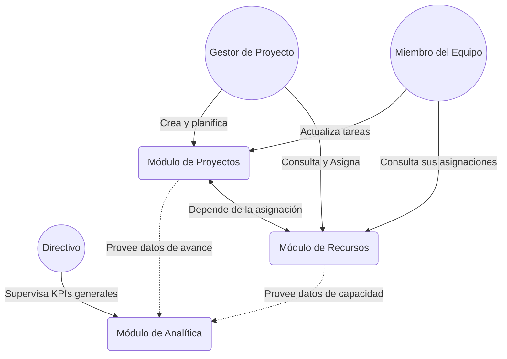

# Innovatech Solutions – Plataforma Inteligente

## Contexto
Innovatech Solutions es una empresa dedicada al desarrollo de software a medida y consultoría para organizaciones de diversos sectores, incluyendo retail, fintech, organizaciones públicas y privadas. Con más de 120 empleados distribuidos en múltiples equipos, la empresa busca resolver los desafíos de coordinación y gestión eficiente mediante el desarrollo de una plataforma tecnológica integrada que centralice la gestión de proyectos, mejore la colaboración y ofrezca herramientas analíticas para la toma de decisiones.

---

## Requerimientos Funcionales (RF)

### Módulo 1: Gestión de Proyectos
* **RF1.1:** El sistema debe permitir crear, editar, eliminar y visualizar proyectos.
* **RF1.2:** El sistema debe permitir definir tareas o entregables asociados a cada proyecto.
* **RF1.3:** El sistema debe permitir la asignación de individuos o roles específicos a las tareas del proyecto.
* **RF1.4:** El sistema debe permitir actualizar y monitorear el estado y avance de las tareas (ej. Pendiente, En Progreso, Completado).
* **RF1.5:** El sistema debe notificar a los responsables sobre nuevas asignaciones y fechas de entrega vencidas.

### Módulo 2: Gestión de Recursos y Colaboración
* **RF2.1:** El sistema debe mantener un registro de los profesionales con su rol, habilidades y proyectos asignados.
* **RF2.2:** El sistema debe mostrar la disponibilidad y la capacidad de trabajo (*capacity*) de cada profesional en tiempo real para evitar sobrecarga o subutilización.
* **RF2.3:** El sistema debe permitir la asignación o reasignación de profesionales a diferentes proyectos según su disponibilidad.
* **RF2.4:** El sistema debe proveer herramientas o foros asociados a cada proyecto para que los equipos registren comentarios y notas de colaboración.

### Módulo 3: Monitoreo y Analítica
* **RF3.1:** El sistema debe proveer un panel (Dashboard) interactivo dirigido a directivos y gestores de proyecto.
* **RF3.2:** El sistema debe calcular y mostrar indicadores clave de desempeño (KPIs) en tiempo real (ej. tasa de cierre de tareas, retrasos).
* **RF3.3:** El sistema debe mostrar métricas de avance de cada proyecto en comparación con los plazos establecidos.
* **RF3.4:** El sistema debe mostrar métricas de utilización de recursos por área o por proyecto.

---

## Requerimientos No Funcionales (RNF)

* **RNF1 (Usabilidad):** La interfaz de usuario debe ser intuitiva, responsiva y adaptable a dispositivos móviles y de escritorio.
* **RNF2 (Rendimiento):** El sistema debe soportar acceso concurrente de al menos 120 usuarios sin comprometer los tiempos de respuesta.
* **RNF3 (Seguridad):** El sistema debe requerir autenticación para el acceso a la plataforma, y utilizar roles de usuario (ej. Administrador, Gestor de Proyecto, Desarrollador) para autorizar accesos a distintos módulos.
* **RNF4 (Escalabilidad):** El sistema debe estar diseñado de forma que permita agregar nuevas funcionalidades o aumentar la carga de usuarios sin interrupciones severas.
* **RNF5 (Auditoría):** Toda asignación o cambio de estado de tareas importantes debe quedar registrada con el historial de modificaciones y el usuario responsable.

---

## Casos de Uso Principales

1. **Crear / Planificar un Proyecto**
   * *Actor:* Gestor de Proyectos
   * *Descripción:* El gestor ingresa la información del nuevo proyecto, define etapas y tareas específicas.
2. **Consultar Capacidad de Equipo y Asignar Recurso**
   * *Actor:* Gestor de Proyectos / Roles de Liderazgo
   * *Descripción:* El líder revisa el tablero de *capacity*, verifica la disponibilidad de un profesional y lo asigna a un proyecto.
3. **Actualizar el Estado de una Tarea**
   * *Actor:* Miembro del Equipo
   * *Descripción:* El profesional ingresa al sistema, revisa sus tareas asignadas y cambia su estado al finalizar el trabajo, pudiendo añadir comentarios.
4. **Visualizar el Rendimiento Global (Dashboard)**
   * *Actor:* Directivo
   * *Descripción:* El directivo accede al panel de control interactivo para observar el avance de la empresa, utilización de recursos globales y proyectos críticos o atrasados.

---

## Diagrama de Funcionamiento (Alto Nivel)



---

## Entorno de Desarrollo y Despliegue

Para facilitar la colaboración y el trabajo en distintos entornos (Windows, Mac, Linux) y diversos IDEs (IntelliJ IDEA, Antigravity, VS Code), el proyecto está completamente contenerizado.

### 1. Ejecutar Todo con Docker (Recomendado)
Para levantar todos los microservicios y sus bases de datos asociadas en contenedores de Docker, sin necesitar tener instaladas versiones específicas de Java o Maven localmente:

Construir y levantar en segundo plano (`-d`):
```bash
docker-compose up -d --build
```
* **Project Service**: `http://localhost:8081`
* **Resource Service**: `http://localhost:8082`
* **pgAdmin (BBDD)**: `http://localhost:5051` (admin@innovatech.cl / admin)

Para detener la ejecución:
```bash
docker-compose down
```

### 2. Desarrollo con tu IDE Favorito
Si prefieres correr el código localmente en tu IDE para poder usar Debug o probar cambios rápidamente, puedes levantar únicamente las bases de datos con Docker y ejecutar la aplicación desde el IDE.

**Paso 1:** Levanta las bases de datos y pgAdmin:
```bash
docker-compose up -d project-db resource-db pgadmin
```

**Paso 2:** Ejecuta las aplicaciones:
- **IntelliJ IDEA:** IntelliJ detectará automáticamente el proyecto multi-módulo Maven. Busca las clases `ProjectManagementApplication` y `ResourceServiceApplication` y presiona el botón verde de "Run/Debug".
- **Antigravity / VS Code:** Asegúrate de aceptar las recomendaciones de extensiones (Extension Pack for Java y Spring Boot). Usa la pestaña "Spring Boot Dashboard" en el panel lateral para ejecutar los proyectos, o simplemente presiona Run en los archivos principales.

*Nota: Las propiedades `application.properties` de los microservicios están configuradas con variables de entorno que tienen `localhost` por defecto. ¡Funcionarán mágicamente desde tu IDE sin configuración adicional!*
